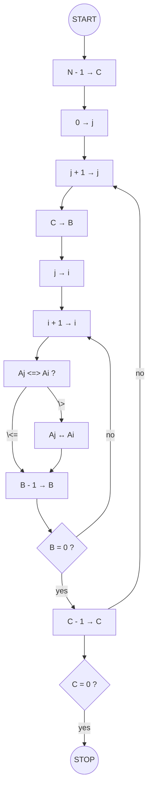

# Sort and Division

## Flow

### Sort

```mermaid
graph TD

SortStart(("START")) --> 1["N - 1 &rarr; C"];
1 --> 2["0 &rarr; j"];
2 --> 3["j + 1 &rarr; j"];
3 --> 4["C &rarr; B"];
4 --> 5["j &rarr; i"];
5 --> 6["i + 1 &rarr; i"];
6 --> 7["Aj <=> Ai ?"];
7 --\<=--> 9["B - 1 &rarr; B"];
7 --\>--> 8["Aj &harr; Ai"];
8 --> 9;
9 --> 10{"B = 0 ?"};
10 --yes--> 11["C - 1 &rarr; C"];
10 --"no"--> 6;
11 --> 12{"C = 0 ?"};
12 --yes--> SortStop(("STOP"));
11 --"no"--> 3;

```

$$2^2$$
