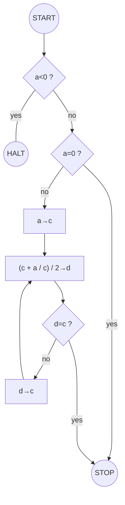

# Square root :keyboard::deciduous_tree:

This is the trace, over 50 years of a simple square root calculation journey.  
Starting with 70's machine code, through 90-00's structured code, and to the 2020's abstracted code.

## Assembly vs C vs Python :crossed_swords:

|Language    |Represents     |
|------------|---------------|
|**Assembly**|*Legacy*       |
|**C**       |*Old-fashioned*|
|**Python**  |*Modern*       |

## About the Code :memo:

### 8085 Assembly :classical_building:

This is a sample of the subroutine structure of Assembly code.

- Full control, do everything.
- Hardware-centric
- The programmer controls
  - Guessing
  - Division (by bit shift)
  - Memories and registers
  - Technically, everything
- Even the division function did not exist.
- So, the extra subroutine for division was needed.
- Human-friendly machine code.

### C :floppy_disk:

This is the basic structured code with a subroutine.

- Just guide the logic.
- Flow-centric
- The programmer controls
  - Logic (calculations)
  - Loop
- No need to consider memory structure - the compiler handles memory and registers.
- Able to use operands in calculations.
- More readable for humans.

\* ***Please don't say "you can use \<math.h\>."*** :sweat_smile:

### Python :computer:

This is a modern abstracted code.

- Ask everything to the system.
- Outcome-centric
- The programmer controls
  - Flow
  - Input and output
- No need to think about basic mathematical logic.
- They are in the library functions.
- Able to understand almost intuitively.

## Final Thoughts :clipboard:

This is a simple function to find the square root of n.  
You need only one line to do this math with a modern programming language. However, there are almost 50 steps of machine code hiding behind that only one line.  
If you understand what lies beneath, and care about every line of code you write, the system you build will be more beautiful &mdash;and more elegant.

## Flow :twisted_rightwards_arrows:

